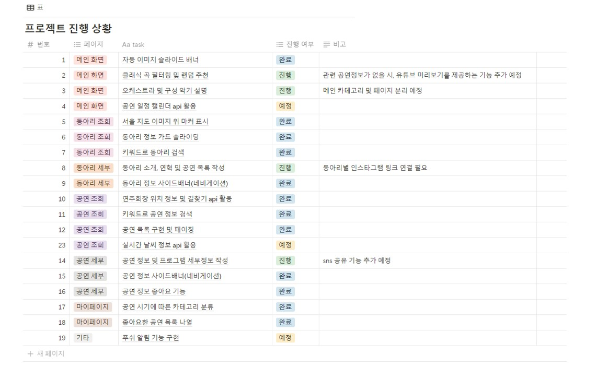

## Project Summary
본 프로젝트의 목표는 서울 소재 대학교 아마추어 오케스트라 동아리의 홍보와 공연 정보를 통합적으로 제공하는 웹 플랫폼의 구현입니다.  기존에는 각 동아리가 소셜미디어나 독립적인 채널을 통해 정보를 제공함에 따라, 사용자들이 공연 일정과 동아리 정보를 파악하기 위해 여러 채널을 검색해야 하는 번거로움이 있었습니다. 본 프로젝트는 이러한 문제를 해결하고, 사용자에게 통합된 정보를 제공함으로써 오케스트라와 클래식 음악에 대한 접근성을 높이고자 합니다. 
 

### 1. 메인 페이지
- 사용자 선택 옵션을 기반으로 클래식 음악과 동아리 공연을 추천하는 기능을 제공
- 오케스트라와 악기에 대한 설명을 통해 관련 정보를 제공

### 2. 서울 아마추어 오케스트라 동아리 소개
- 지도 마커를 활용해 각 동아리의 위치를 표시하고 세부 정보를 제공
- 동아리 검색 기능을 통해 원하는 동아리를 찾을 수 있으며, 검색 결과에서 해당 동아리의 세부 페이지로 이동 가능
- 동아리 세부 페이지에서 동아리 소개와 연혁을 확인할 수 있고, 연주회 세부 페이지로 이동할 수 있는 기능도 포함

### 3. 공연 정보 조회
- 지도 API를 통해 연주회장의 위치 정보와 길찾기 기능을 제공
- 연연주회 검색 및 검색 결과를 기반으로 연주회 세부 페이지 이동 가능
- 연주회 세부 페이지에서 공연 포스터, 셋리스트, 곡 및 작곡가, 공연장 정보, 관람 에티켓에 대한 설명 제공
- 관심 버튼을 통해 원하는 공연을 마이페이지에 저장 가능

### 4. 마이페이지
- 관심 버튼으로 저장한 공연을 지난 공연과 예정 공연으로 구분하여 관리
- 각 탭을 통해 저장된 공연을 손쉽게 탐색 가능
- 관심 취소 버튼으로 저장된 공연을 삭제하는 기능 제공

   

## Project Schedule

   

## Project Screenshot

<b>메인 페이지</b>

 

<b>동아리 페이지</b>

동아리 정보 및 검색 페이지

 

<b>연주회 페이지</b>

동아리 공연 정보 및 길찾기 페이지

 

<b>동아리 별 세부페이지</b>

 

<b>연주회 별 세부페이지</b>

 

<b>마이 페이지 </b> 

 

  

## Individual Progress Status  

### 최경정

#### **홈 화면 자동 이미지 슬라이드 배너**
- 오케스트라와 관련된 이미지를 슬라이드 배너로 구현 
- 슬라이드 배너는 3초 간격으로 자동 전환되며, 좌우 버튼을 통해 수동 탐색도 가능
- 무한 루프 형식으로 구현하여 슬라이드 끝에서 다시 처음으로 자연스럽게 이어지는 구조를 제공
- 페이지 가장 하단에 오케스트라를 구성하는 악기 소개

<b>해당 커밋 목록</b>

  
- [(이미지 슬라이드 배너 구현)](https://github.com/kyeongjeong/Seoul_amateur_orchestra_club/commit/a1684a308b1f110a453296f621bf6ef51df4fb4f) 
- [(무한 루프 형식으로 변경)](https://github.com/kyeongjeong/Seoul_amateur_orchestra_club/commit/4cfbe4493f950ff8a17c5a6eb5264fd2d5d59dc6) 
- [(자동 슬라이드 기능 추가)](https://github.com/kyeongjeong/Seoul_amateur_orchestra_club/commit/4bc42b5b8a92a0b55629a3f572f1b22ad80b8e5e) 

#### **홈 화면 클래식 곡 필터링 및 랜덤추천 기능**
- 89개의 클래식 곡 데이터를 JSON 형식으로 생성하고 이를 기반으로 곡 필터링 및 추천 기능을 구현
- 4개의 옵션(시대, 장르, 주요 악기, 나라)을 다중 선택 가능하게 구성, 사용자 선택 사항을 UI 상에 직접적으로 표시
- 선택한 옵션은 자유롭게 삭제 가능하며, 삭제 방식은 옵션 더블클릭 또는 삭제 아이콘 클릭으로 제공
- 사용자가 선택한 옵션에 부합하는 곡 중 하나를 랜덤으로 추천
- 사용자가 옵션을 아무것도 선택하지 않았을 경우 경고창
- 필터링 결과가 없을 경우, 조건과 무관하게 곡을 랜덤 추천하여 결과를 제공
- 추천 곡과 연계된 공연 카드(공연 포스터, 공연명, 공연 날짜로 구성)들을 생성 및 나열
- 공연 카드 클릭 시 해당 공연 상세 페이지로 이동하도록 구현

<b>해당 커밋 목록</b>

- [(89개의 클래식 곡 json 추가)](https://github.com/kyeongjeong/Seoul_amateur_orchestra_club/commit/448594cebce4ee05cb6d5bff2e45be3b86a1444c) 
- [(옵션 선택창 구현)](https://github.com/kyeongjeong/Seoul_amateur_orchestra_club/commit/927bdc231e13fe6a77a4697a64c0985c10898acb) 
- [(필터링 및 랜덤추천 기능 추가)](https://github.com/kyeongjeong/Seoul_amateur_orchestra_club/commit/fd3df425149aec4276b933bba1e5a229339f7512) 
- [(관련 공연 목록 구현)](https://github.com/kyeongjeong/Seoul_amateur_orchestra_club/commit/090e6ac90c8b38d780958af3519e41923eab326c) 

#### **오케스트라 동아리 정보 조회**
- 서울 지도 이미지를 활용하여 동아리 위치를 시각화하며, 각 동아리 위치를 마커로 표시
- 지도 비율에 따라 반응형으로 설계하여 화면 크기가 변경되어도 마커 위치와 비율을 유지
- 마커에 마우스를 올리면 동아리명과 소속 대학명을 툴팁 형태로 표시
- 마커 클릭 시 해당 동아리의 상세 정보 페이지로 이동 가능
- 동아리 로고, 소속 대학명, 동아리명으로 구성된 카드 형태 UI를 제공하며, 좌우 버튼으로 탐색 가능
- 동아리명 및 소속 대학명을 기준으로 검색 가능한 검색창을 구현
- 검색 결과를 클릭하면 해당 동아리의 상세 정보 페이지로 연결

<b>해당 커밋 목록</b>

- [(지도 삽입 및 위치 수정)](https://github.com/kyeongjeong/Seoul_amateur_orchestra_club/commit/689fda62818a7c2e44061a2ef5a7cec1b6105c55) 
- [(마커 삽입 및 페이지 연결)](https://github.com/kyeongjeong/Seoul_amateur_orchestra_club/commit/7ae2099b2a354c8c5e6d0b32630825f90f9e1bc8) 
- [(검색창 구현)](https://github.com/kyeongjeong/Seoul_amateur_orchestra_club/commit/fb43abf7df11d06624589c90a251d187fecf5859) 
- [(슬라이드 기능 구현)](https://github.com/kyeongjeong/Seoul_amateur_orchestra_club/commit/e21993ee2e297628aa5dcd959cf2bdf2ff0e5188) 
- [(로고+동아리명+소속대학명 카드 구현)](https://github.com/kyeongjeong/Seoul_amateur_orchestra_club/commit/81b30fc44b61752555c40d278df181af062ec0d4) 
- [(검색 예외처리)](https://github.com/kyeongjeong/Seoul_amateur_orchestra_club/commit/281164830760dd5e4f819c09c01fa44ae7b42409) 
- [(마커 튤팁 추가)](https://github.com/kyeongjeong/Seoul_amateur_orchestra_club/commit/2c6e18c6677085e3286a0632db010219dbbd56cc) 

 

### 이오영

#### **헤더 및 UI 개선**  
- 로고와 카테고리를 포함한 헤더 구현  

<b>해당 커밋 목록</b>

- [(헤더 구현)](https://github.com/kyeongjeong/Seoul_amateur_orchestra_club/commit/97971ede338a06b028429b1872067e50dc048e50) 

 

#### **지도 및 길찾기 기능**  
- 지도 API를 활용해 마커 클릭 시 팝업 화면 구현  
- 출발지와 목적지 키워드 검색 및 지도에 마커 표시  
- 키워드로 검색 후 출발지·목적지 장소 선택
- 위치 선택 화면 제목에 숫자 표시 추가 
- 위치 선택 화면에서 선택된 장소의 색상을 고정 및 선택 상태 표시  
- 선택한 장소를 경도·위도로 변환
- 길찾기 API를 활용해 경로와 소요 시간 계산
- 길찾기 완료 후 지도를 출발지·목적지 중심으로 위치 조정
- 길찾기 결과 화면의 디자인 및 내용 추가

<b>해당 커밋 목록</b>

- [(지도 API 사용하여 팝업화면 구현)](https://github.com/kyeongjeong/Seoul_amateur_orchestra_club/commit/e0c6cd30d9adadd106ceb0f6952afdebd318ff89) 
- [(키워드로 검색 후 출발지·목적지 장소 선택)](https://github.com/kyeongjeong/Seoul_amateur_orchestra_club/commit/a2f021b263f92642c8804edbaa9f83007d645043) 
- [(검색 이후 해당 장소를 지도에 표시)](https://github.com/kyeongjeong/Seoul_amateur_orchestra_club/commit/fc5ad1087800ba41966071be171bca7b04f487d3) 
- [(위치 선택 화면 제목에 숫자 표시 추가)](https://github.com/kyeongjeong/Seoul_amateur_orchestra_club/commit/41b4bc3d66d87948aa61b0b73b419548baf536fa) 
- [(위치 선택 화면에서 선택된 장소의 색상을 고정 및 선택 상태 표시)](https://github.com/kyeongjeong/Seoul_amateur_orchestra_club/commit/0a56e80279e9e4fa4ced5cc15e8fd03683161c49) 
- [(선택한 장소를 경도·위도로 변환)](https://github.com/kyeongjeong/Seoul_amateur_orchestra_club/commit/788a6d5025e2ef4c974479ae77ce7d9ce00f2a1b) 
- [(길찾기API를 이용하여 길찾기 기능 추가)](https://github.com/kyeongjeong/Seoul_amateur_orchestra_club/commit/dbd1f51504054c489ce2ecfb335cf0a073649bf0) 
- [(길찾기 API를 활용해 지도에 경로 표시)](https://github.com/kyeongjeong/Seoul_amateur_orchestra_club/commit/7f3e8776294e28d2c1d86b7964b78ad7442452a7) 
- [(길찾기 API를 활용해 소요 시간 계산)](https://github.com/kyeongjeong/Seoul_amateur_orchestra_club/commit/66f98d1029148de5ddf9ee245035475c9324b730) 
- [(길찾기 완료 후 지도를 출발지·목적지 중심으로 위치 조정)](https://github.com/kyeongjeong/Seoul_amateur_orchestra_club/commit/1909ac3a03966877d89acf3c16d38d66949438fa) 
- [(길찾기 결과 화면의 디자인 및 내용 추가)](https://github.com/kyeongjeong/Seoul_amateur_orchestra_club/commit/69239583618657b8df5f74ccb4dc3f15d91c9b3c) 

 

#### **공연 정보 기능 개선**  
- 공연 정보 틀 구현 및 페이징 기능 추가
- 공연 정보 검색 기능 구현
- 공연 정보 레이아웃 4분할 수정 및 JSON 데이터 연결  
- 검색 키워드 및 연결 사이트 수정  

<b>해당 커밋 목록</b>

- [(공연 정보 틀 구현 및 페이징 기능 추가)](https://github.com/kyeongjeong/Seoul_amateur_orchestra_club/commit/9ea293e4568bb33397d90bf070e80df9cfe4a760) 
- [(공연 정보 검색 기능 구현)](https://github.com/kyeongjeong/Seoul_amateur_orchestra_club/commit/02b60fcb21e7ce450cd93d6c9062f4bad5a09c81) 
- [(공연 정보 레이아웃 4분할 수정)](https://github.com/kyeongjeong/Seoul_amateur_orchestra_club/commit/caee448b0eac61e37de455a159a680e9cf2af9d3) 
- [(공연 정보와 JSON 데이터 연결)](https://github.com/kyeongjeong/Seoul_amateur_orchestra_club/commit/bee9743af901f9186a2ca38df19447163b619a55) 
- [(검색 키워드에 공연명, 동아리명, 대학교가 검색 가능하도록 수정)](https://github.com/kyeongjeong/Seoul_amateur_orchestra_club/commit/fa82c934e9331c464679aa007194b59a8c4f35b9) 

 
 

### 곽도경

#### **사이드배너 활성화**
- 사이드 배너 클릭 시 해당 섹션으로 이동 
- 현재 보고 있는 섹션에 따라 배너 버튼 활성화 상태 업데이트
- 페이지 로드 시 첫 번째 배너 버튼 활성화 설정

<b>해당 커밋 목록</b>

- [(사이드배너 활성화,화면에 따라 버튼 상태 업데이트)](https://github.com/kyeongjeong/Seoul_amateur_orchestra_club/commit/3f84a3981d24247d1090b51a710648cbc1a88e4e) 
- [(페이지 로드 시 첫 번째 버튼 활성화)](https://github.com/kyeongjeong/Seoul_amateur_orchestra_club/commit/daf6743c7b7a5044d3274455b255a11450820939) 

#### **좋아요 버튼 활성화**
- 좋아요 버튼 클릭시 하트 이모지 변경
- 로컬스토리지 활용하여 페이지 새로고침 후에도 버튼 상태 유지 및 마이페이지 데이터 제공
- 각 HTML 페이지마다 독립적으로 좋아요 상태 저장

<b>해당 커밋 목록</b>

- [(좋아요 버튼 활성화)](https://github.com/kyeongjeong/Seoul_amateur_orchestra_club/commit/59cbc66327054c6d3726615f6561d9ed30aac311) 
- [(버튼 독립적으로 상태 저장 및 로컬 스토리지 활용)](https://github.com/kyeongjeong/Seoul_amateur_orchestra_club/commit/50c6c5ca3a86e85421c75401fa633f803509f94b) 

#### **동아리 별 연주회 정보 수집**
- 연주회 세부 페이지 틀 디자인 및 구현
- 13 개의 연주회 html 생성 및 내용 추가
- 연주회 정보 json 데이터 생성 
- 음악 추천을 위한 idx, 음악 추가
- html 페이지 내 연주회 정보 동적 로드

<b>해당 커밋 목록</b>

- [(연주회 세부 페이지 틀 구현)](https://github.com/kyeongjeong/Seoul_amateur_orchestra_club/commit/bbc8babb2073263a6c0928388bd89e981c4636f2)  
- [(연주회정보 json 생성)](https://github.com/kyeongjeong/Seoul_amateur_orchestra_club/commit/5f778c17ac3a3df34288d273578cba86d88aca26) 
- [(DaKAPO html 생성, 내용 추가 및 정보 동적 로드)](https://github.com/kyeongjeong/Seoul_amateur_orchestra_club/commit/418e53f7225be180aa5802a1345edfa6e70e5611)  
- [(HIAMO html 생성 및 내용 추가)](https://github.com/kyeongjeong/Seoul_amateur_orchestra_club/commit/a50bf716fa20b4f34ebb090f1cc3f50f590b759c) 
- [(Kurorchestra html 생성 및 내용 추가, json 추가)](https://github.com/kyeongjeong/Seoul_amateur_orchestra_club/commit/d3e95a3c6e38d1fc175dc23cecaed5f02d4ffb74)  
- [(ACES html 생성  및 내용 추가, json 추가)](https://github.com/kyeongjeong/Seoul_amateur_orchestra_club/commit/e67dfa73b891c0d94a73d9dfc50bc804dd3ad733)  
- [(SNUPO html 생성  및 내용 추가, json 추가)](https://github.com/kyeongjeong/Seoul_amateur_orchestra_club/commit/a272af03f692b54e2a0aa80f62ece945e43ef68a)  
- [(SKKUO html 생성  및 내용 추가, json 추가)](https://github.com/kyeongjeong/Seoul_amateur_orchestra_club/commit/bc098fb103c7e6a4d8ceae1ffd229bcb78b78c8d)  
- [(hanaklang html 생성  및 내용 추가, json 추가)](https://github.com/kyeongjeong/Seoul_amateur_orchestra_club/commit/77fe0e3d81c87167139d0fe224a6833b9e702713)  
- [(RUBATO html 생성  및 내용 추가, json 추가)](https://github.com/kyeongjeong/Seoul_amateur_orchestra_club/commit/9d2afb39736743b1ea6e5ad9638d1202eda9025d)  
- [(MDOP html 생성  및 내용 추가, json 추가)](https://github.com/kyeongjeong/Seoul_amateur_orchestra_club/commit/385a16dd6ca2a3b3c2e71fb4500280fb07cfea0c)  
- [(cantabile html 생성  및 내용 추가, json 추가)](https://github.com/kyeongjeong/Seoul_amateur_orchestra_club/commit/99b53a09be0fe9645993ea76d57546bae19cd175)  
- [(KUPHIL html 생성  및 내용 추가, json 추가)](https://github.com/kyeongjeong/Seoul_amateur_orchestra_club/commit/6351dfed03d7be3a6e31d33aef3d2d4894b8fcb8)  
- [(OPUS html 생성  및 내용 추가, json 추가)](https://github.com/kyeongjeong/Seoul_amateur_orchestra_club/commit/39862fee003a63e593ba6e4840b3dd162d91fc9d)  
- [(Sophia html 생성  및 내용 추가, json 추가)](https://github.com/kyeongjeong/Seoul_amateur_orchestra_club/commit/3bacf4dc75259c398d4c3bf625e0a937da5b001f)  
- [(idx, music json 정보 추가)](https://github.com/kyeongjeong/Seoul_amateur_orchestra_club/commit/8d320d3a169f4107b506f129da2934ebc0f6b1b6) 

 

### 김하경

#### **스크롤 내비게이션 기능**
- 클릭 시 해당 섹션으로 부드럽게 이동하도록 구현
- 사용자가 스크롤로 페이지를 이동할 경우, 현재 위치에 맞게 내비게이션 상태가 동적으로 업데이트되도록 설정

<b>해당 커밋 목록</b>

  
- [(스크롤 내비게이션 구현)](https://github.com/kyeongjeong/Seoul_amateur_orchestra_club/pull/6/commits/df6f4fee0b1e8cae51557f87f83e75a917fc8078) 
- [(클릭 시 이동하는 위치 고정)](https://github.com/kyeongjeong/Seoul_amateur_orchestra_club/commit/c4109e89be76112b03adc212960c3dfeb42cf998) 

#### **세부 동아리 정보 기능**
- 동아리 세부 페이지 틀 디자인 및 구현
- 13개의 동아리 html 생성 및 내용 추가
- 해당 동아리의 연주회 정보를 확인할 수 있도록 세부 페이지 이동 기능 추가

<b>해당 커밋 목록</b>

  
- [(동아리 세부 페이지 틀 구현)](https://github.com/kyeongjeong/Seoul_amateur_orchestra_club/commit/df6f4fee0b1e8cae51557f87f83e75a917fc8078) 
- [(해당 연주회 세부 페이지 이동 기능 구현)](https://github.com/kyeongjeong/Seoul_amateur_orchestra_club/commit/d2e7710b95a501ddc6dc4697ca01d929e2e2b774) 
- [(DaKAPO html 구현)](https://github.com/kyeongjeong/Seoul_amateur_orchestra_club/commit/8b9a403fef6197766984ac19c60b2f8a7d2a67fd) 
- [(Kuorchestra html 생성 및 소개 섹션 구현)](https://github.com/kyeongjeong/Seoul_amateur_orchestra_club/commit/163eee632f371811683b2b55d5e3bb6b3d5c3323) 
- [(Kuorchestra html 연혁 섹션 구현)](https://github.com/kyeongjeong/Seoul_amateur_orchestra_club/commit/f09552636b92a56f85315cdff0f26241cd9e4a69) 
- [(SNUPO html 생성 및 소개 섹션 구현)](https://github.com/kyeongjeong/Seoul_amateur_orchestra_club/commit/75c65d1bbf2d082a519ba0cd1d7a7cf6fb2230cc) 
- [(SNUPO html 연혁 섹션 구현)](https://github.com/kyeongjeong/Seoul_amateur_orchestra_club/commit/8255432f6d71452a2591e7cd1b0b2c15c90fad72) 
- [(ACES html 생성 및 소개 섹션 구현)](https://github.com/kyeongjeong/Seoul_amateur_orchestra_club/commit/f081016f1eaf65d13bc9e25a5cd95a8532b8ad39) 
- [(ACES html 연혁 섹션 구현)](https://github.com/kyeongjeong/Seoul_amateur_orchestra_club/commit/fe8df5d23313b90048c5d7d7625c4ccaae00b946) 
- [(SKKUO html 생성 및 연혁 섹션 구현)](https://github.com/kyeongjeong/Seoul_amateur_orchestra_club/commit/1f9533a834fd112a49f89de671c738d20b87405d) 
- [(SKKUO html 소개 섹션 구현)](https://github.com/kyeongjeong/Seoul_amateur_orchestra_club/commit/2512c0a0650e5b3129594e345deca55e55503813) 
- [(Hanaklang html 구현)](https://github.com/kyeongjeong/Seoul_amateur_orchestra_club/commit/936ad8af43e32fb31acca6c76e1fa5fdf2bcc087) 
- [(Rubato html 구현)](https://github.com/kyeongjeong/Seoul_amateur_orchestra_club/commit/6af076434b7be38cf54c955c7191a37d870f65b7) 
- [(MDOP html 생성 및 연혁 섹션 구현)](https://github.com/kyeongjeong/Seoul_amateur_orchestra_club/commit/1f9533a834fd112a49f89de671c738d20b87405d) 
- [(MDOP html 소개 섹션 구현)](https://github.com/kyeongjeong/Seoul_amateur_orchestra_club/commit/07564d0c126a28f096ac00aab3f08d477b1a8a39) 
- [(Cantabile html 생성 및 소개 섹션 구현)](https://github.com/kyeongjeong/Seoul_amateur_orchestra_club/commit/c52cbbe3d87cdf4b32a02d32722a21ea638432c3) 
- [(Cantabile html 연혁 섹션 구현)](https://github.com/kyeongjeong/Seoul_amateur_orchestra_club/commit/8d32d9b7cef444b55c82c2d6eccee6ce78bac667) 
- [(Kuphil html 생성 및 연혁 섹션 구현)](https://github.com/kyeongjeong/Seoul_amateur_orchestra_club/commit/611590c1a39d98f9c59f7b072c981eccb7af86ce) 
- [(Kuphil html 소개 섹션 구현)](https://github.com/kyeongjeong/Seoul_amateur_orchestra_club/commit/b4790c12964e49bfca37e9c58c589d14a6b67862) 
- [(Opus html 생성 및 연혁 섹션 구현)](https://github.com/kyeongjeong/Seoul_amateur_orchestra_club/commit/9116865c3851e916b6127e168ff0bc2c8d23516f) 
- [(Opus html 소개 섹션 구현)](https://github.com/kyeongjeong/Seoul_amateur_orchestra_club/commit/1d65058ea547a82cc4b2f02c03aca43ebfed91aa) 
- [(SOPHIA html 생성 및 소개 섹션 구현)](https://github.com/kyeongjeong/Seoul_amateur_orchestra_club/commit/d4fc13634a2487fa5ac2ee97b0f84295bf8acb63) 
- [(SOPHIA html 연혁 섹션 구현)](https://github.com/kyeongjeong/Seoul_amateur_orchestra_club/commit/a731958672f4b88a065e564c35a2e5677baad9dc) 
- [(HIAMO html 구현)](https://github.com/kyeongjeong/Seoul_amateur_orchestra_club/commit/8aacc291870f03da755e70089dc3ba7a5658f5e8) 

#### **마이페이지 좋아요 버튼 활성화**
- 로컬스토리지를 활용하여 사용자가 좋아요를 누른 공연 정보를 유지
- 공연의 날짜와 현재 시간을 기준으로 지난 공연과 예정 공연을 구분하여 표시
- 좋아요 취소 버튼을 통해 로컬스토리지에서 데이터를 삭제할 수 있도록 구현

<b>해당 커밋 목록</b>

  
- [(마이페이지 틀 구현)](https://github.com/kyeongjeong/Seoul_amateur_orchestra_club/commit/5a8d70389dd8d1c15d55b88d7943ff38135d5434) 
- [(예정 공연, 지난 공연 선택 탭 구현)](https://github.com/kyeongjeong/Seoul_amateur_orchestra_club/commit/4f5043e4bf82fab8f713bc45e950c86ded8e6075) 
- [(예정 공연, 지난 공연 선택 탭 이동 구현)](https://github.com/kyeongjeong/Seoul_amateur_orchestra_club/commit/aa45d85e2feccdfb47d4e1bfcd3168aa40f37b30) 
- [(좋아요 버튼 구현)](https://github.com/kyeongjeong/Seoul_amateur_orchestra_club/commit/bf521e7d56c2fbde6e42454e5760fcdff34aaef6) 
- [(로컬스토리지를 활용하여 관심 공연 정보 표시 기능 구현)](https://github.com/kyeongjeong/Seoul_amateur_orchestra_club/commit/28fb3035efc5f85e0b4e80b0a6173d445c39aee6) 
- [(예정 공연, 지난 공연 구분 기능 구현)](https://github.com/kyeongjeong/Seoul_amateur_orchestra_club/commit/9d06d0a176470b83dc25eb4f9695e9853763a125) 
- [(관심 공연 삭제 기능 구현)](https://github.com/kyeongjeong/Seoul_amateur_orchestra_club/commit/b415696fcf79dbede66e37925d1cd8ba6fbe15b8) 

   
