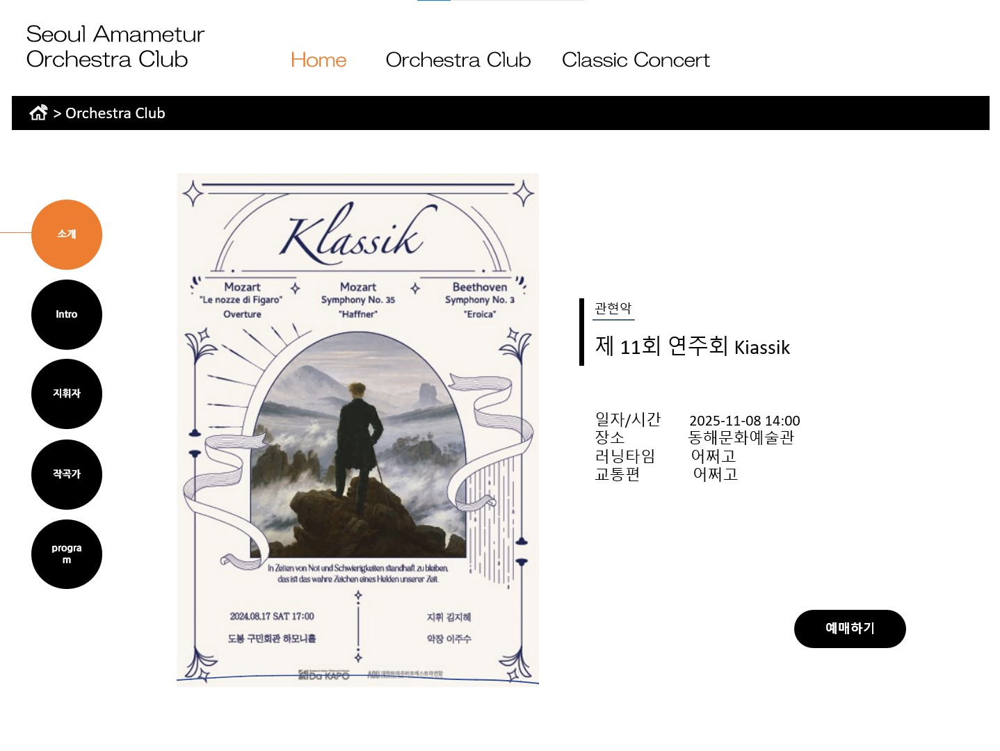

# Seoul Amateur Orchestra Club

## 👋 팀 소개
안녕하세요!

저희는 광운대학교 컴퓨터정보공학부 학부생 4명으로 이루어진 팀으로

오픈소스소프트웨어설계및실습 과목 프로젝트를 진행하고 있습니다.

구성원은 2021202078 최경정(팀장), 2023202021 곽도경, 2023202087 김하경, 2021202017 이오영입니다.
   

## 💾 프로젝트 요약
본 프로젝트는 **학교 오케스트라 동아리 홍보 및 공연 정보를 제공**하는 웹사이트를 구현하는 것이 목표입니다. 

프로 오케스트라 공연의 경우, 예술의전당이나 롯데콘서트홀과 같은 주요 공연장에서 일정을 쉽게 확인할 수 있는 웹사이트와 플랫폼이 구축되어 있습니다. 
그러나 아마추어 대학교 오케스트라의 경우, 공연 정보가 모여 있는 통합 사이트가 전혀 존재하지 않기에 각 동아리에서 인스타그램이나 기타 소셜미디어를 통해 공지하는 공연 일정을 일일이 직접 확인해야 하는 번거로움이 따릅니다.
저희 프로젝트는 서울 내 아마추어 오케스트라 동아리들의 소개와 공연 정보를 한 곳에 모아 제공함으로써, 이러한 불편함을 해소하고자 합니다. 
  

### 1. 메인 페이지
- **자동 슬라이딩 베너(카로셀)** : 주요 공연 이미지와 동아리 활동 사진을 자동 슬라이드 형태로 제공.
- **카테고리 버튼** : 동아리 소개 및 공연 정보 페이지로의 직관적인 이동 가능.
- **실시간 날씨 정보** : 공연장 방문을 위한 실시간 날씨 정보 지원.
- **악기 정보 제공** : 오케스트라 악기에 대한 간단한 설명과 정보 제공.
### 2. 서울 아마추어 오케스트라 동아리 소개
- **지도 마커** : 지도 마커를 통해 서울 내 동아리 위치를 시각적으로 표시.
- **검색 기능 지원** : 소속대학명과 동아리명으로 동아리 검색 가능.
- **카드 슬라이더** : 동아리 로고, 동아리명, 소속대학명으로 이루어진 카드를 좌우로 슬라이드하여 정보 탐색.
- **동아리별 세부 페이지** : 역사와 연혁, 연주회 기록, 예정된 공연 정보를 확인 가능.
### 3. 공연 정보 조회
- **지도 API** : kakao map api를 활용하여 서울 지역 공연장 정보를 제공.
- **길찾기 지원** : 공연장까지의 이동 경로를 제공하여 사용자 편의성 강화.
- **검색 기능 지원** : 공연명과 동아리명으로 공연 검색 가능.
- **공연 정보 세부 페이지** : 공연 포스터, 셋리스트, 곡 및 작곡가 설명, 공연장 정보, 티켓 예매 정보 등을 제공.
   

## 📷 예시 이미지

    
<b>메인 페이지</b>

    

    
<b>전체적인 동아리 소개 페이지</b>

    

    
<b>공연별 세부정보 페이지</b>

    

  

## 📅 개발 일정
- 11월 1주차 → 프로젝트 조 편성 및 주제 선정
- 11월 2주차 → 디자인 확정 및 역할 분담
- 11월 3주차 → 개인별로 맡은 화면 구현
- 11월 4주차 → 메인페이지 구현 / 외부 API 활용
- 11월 5주차 → 추가기능 구현
- 12월 1주차 → 페이지 통합 및 피드백
- 12월 2주차 → ppt 제작 및 프로젝트 마무리
- 12월 3주차 → 발표 및 최종 결과물 제출
   

## 👀 역할 및 개발분야
- **최경정** : *팀장*, 서울 아마추어 오케스트라 동아리 소개, 지도 마커, 검색 기능, 카드 슬라이더
- **곽도경** : 공연 정보 세부 페이지, 메인 페이지, 자동 슬라이딩 베너(카로셀)
- **김하경** : 동아리별 세부 페이지, 메인 페이지, 실시간 날씨 정보 API 활용
- **이오영** : 공연 정보 조회, 지도 API 활용, 길찾기 API 활용, 검색 기능
   

## 🖥️ 개발환경

    
     
    
    
    
     
    
    

   

---
✉️ contanct us: 팀장 최경정 ariel020918@naver.com

💬 회의록 및 프로젝트 정보: https://fog-apricot-b87.notion.site/1308b56fd67a8049847bf66942ea8bc0
