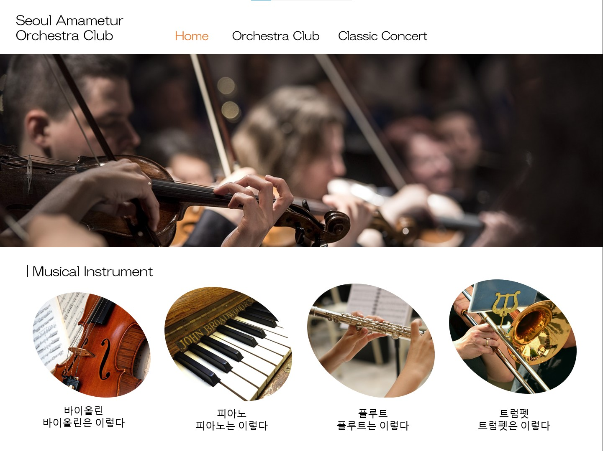
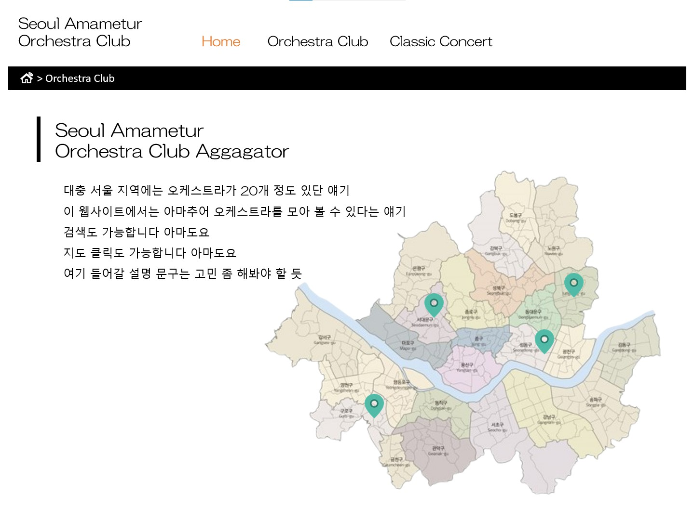

# Seoul Amateur Orchestra Club

## 👋 팀 소개
안녕하세요!

저희는 광운대학교 컴퓨터정보공학부 학부생 4명으로 이루어진 팀으로

오픈소스소프트웨어설계및실습 과목 프로젝트를 진행하고 있습니다.

구성원은 2021202078 최경정(팀장), 2023202021 곽도경, 2023202087 김하경, 2021202017 이오영입니다.

## 💾 프로젝트 요약
본 프로젝트는 **학교 오케스트라 동아리 홍보 및 공연 정보를 제공**하는 웹사이트를 구현하는 것이 목표입니다. 

이 웹사이트를 통해 사람들이 오케스트라 동아리와 공연 정보를 더 쉽게 접하고, 공연 관람에 대한 진입장벽을 낮출 수 있도록 돕고자 합니다.
프로 오케스트라 공연은 사이트에서 일정을 쉽게 확인할 수 있지만, 아마추어 대학교 오케스트라의 경우 각 동아리의 인스타그램 공지를 통해 일일이 확인해야 하는 불편함이 있습니다.
저희 프로젝트는 서울 내 오케스트라 동아리 소개와 공연 정보를 한 곳에 모아 제공함으로써, 이러한 불편함을 해소해주는 걸 목적으로 합니다.

웹사이트는 서울 내 오케스트라 동아리 소개와 공연 정보를 제공하며, 주요 기능으로는 동아리 소개, 공연 정보 조회, 실시간 날씨 정보, 길찾기 등이 포함됩니다. 

**메인 페이지**에서는 카테고리 버튼을 통해 동아리 소개와 공연 정보 페이지로 이동할 수 있으며, 실시간 날씨 정보를 제공합니다. 
또한, 악기 소개를 통해 오케스트라 속 악기에 대한 정보도 확인할 수 있습니다.

**동아리 소개 페이지**에서는 지도 마커를 이용해 동아리 위치를 표시하고 세부 정보를 제공합니다. 
사용자는 동아리를 검색할 수 있으며, 세부 페이지에서는 동아리의 역사와 연혁, 연주회 기록, 그리고 예정된 공연에 대한 정보를 확인할 수 있습니다.

**공연 정보 페이지**에서는 지도 API를 통해 공연장 정보를 제공하며, 길찾기, 공연 검색 기능도 지원합니다. 
세부 페이지에는 공연 포스터, 셋리스트, 각 곡에 대한 간단한 설명, 작곡가 설명, 공연장 정보, 티켓 예매 정보 등이 포함되어 있어 사용자들이 공연에 대한 정보를 쉽게 확인할 수 있습니다.

## 📷 예시 이미지

    
<b>메인 페이지</b>

    

    
<b>전체적인 동아리 소개 페이지</b>

    

    
<b>공연별 세부정보 페이지</b>

    

## 📅 일정
- 11월 1주차 → 프로젝트 조 편성 및 주제 선정
- 11월 2주차 → 디자인 확정 및 역할 분담
- 11월 3주차 → 개인별로 맡은 화면 구현
- 11월 4주차 → 메인페이지 구현 / 외부 API 활용
- 11월 5주차 → 추가기능 구현
- 12월 1주차 → 페이지 통합 및 피드백
- 12월 2주차 → ppt 제작 및 프로젝트 마무리
- 12월 3주차 → 발표 및 최종 결과물 제출

## 👀 역할 및 개발분야
- **최경정** : *팀장*, 전체적인 동아리 소개 페이지, 검색 api 활용
- **곽도경** : 공연별 세부 소개 페이지, 메인 페이지
- **김하경** : 동아리별 세부 소개 페이지, 메인 페이지
- **이오영** : 전체적인 공연 정보 페이지, 지도 api 활용

## 🖥️ 개발환경

 

 

 

---
💬 contanct us: 팀장 최경정 ariel020918@naver.com
